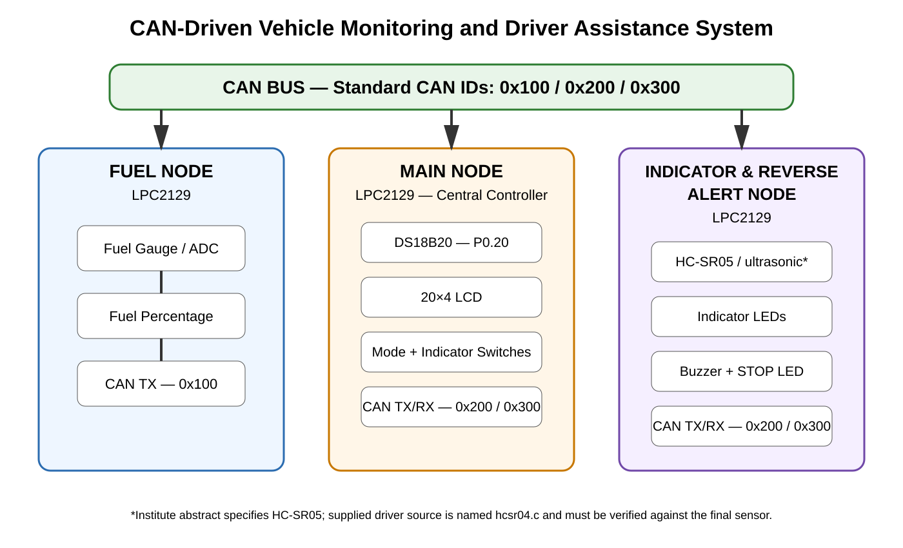
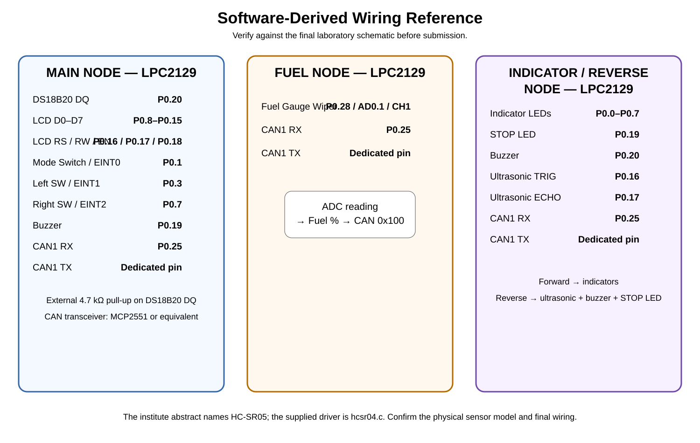

# CAN-Driven Vehicle Monitoring and Driver Assistance System

A three-node automotive embedded system based on **NXP LPC2129 (ARM7TDMI-S)** microcontrollers and **CAN communication**. The project monitors fuel level and engine temperature, controls vehicle indicators, detects obstacles during reverse operation, and displays vehicle status on a centralized LCD dashboard.

> **Final temperature-sensor connection:** DS18B20 DQ is connected to **LPC2129 P0.20** in the current implementation.

## 1. Aim

To design and implement a three-node CAN-driven vehicle monitoring and driver assistance system capable of monitoring fuel level and engine temperature, providing reverse obstacle detection and indicator control, and displaying real-time vehicle status through CAN communication.

## 2. Objectives

- Monitor fuel level using the LPC2129 on-chip ADC.
- Convert the fuel-gauge ADC reading into a fuel percentage.
- Transmit fuel percentage from the Fuel Node to the Main Node through CAN.
- Measure engine temperature using a DS18B20 connected to **P0.20** on the Main Node.
- Display engine temperature, fuel percentage and vehicle mode on the LCD.
- Select Forward/Reverse mode using an external interrupt switch.
- Control left and right indicators using external interrupts and CAN commands.
- Detect reverse obstacles using the ultrasonic sensor.
- Generate SAFE, WARNING and STOP reverse-alert states.
- Drive the buzzer and STOP LED according to reverse-alert status.
- Demonstrate multi-node CAN communication using three LPC2129 controllers.

## 3. System Architecture

The system is divided into three independent nodes connected through a CAN bus.



### Fuel Node

- Reads the fuel gauge through the LPC2129 ADC.
- Converts the ADC value into approximately 0–100% fuel level.
- Sends fuel percentage to the Main Node using CAN ID `0x100`.

### Main Node

The Main Node acts as the central controller.

- Reads engine temperature from the DS18B20 on **P0.20**.
- Receives fuel percentage through CAN.
- Displays temperature and fuel information on a 20×4 LCD.
- Monitors the Mode, Left Indicator and Right Indicator switches using external interrupts.
- Sends Forward/Reverse and indicator commands to the Indicator & Reverse Alert Node using CAN ID `0x200`.
- Receives reverse status and distance using CAN ID `0x300`.

### Indicator & Reverse Alert Node

- Receives vehicle-mode and indicator commands from the Main Node.
- Controls left/right indicator LEDs in Forward mode.
- Enables ultrasonic reverse monitoring in Reverse mode.
- Generates reverse SAFE/WARNING/STOP status.
- Controls the buzzer and reverse STOP LED.
- Sends reverse distance/status back to the Main Node.

## 4. CAN Communication

| CAN ID | Sender | Receiver | Data / Purpose |
|---|---|---|---|
| `0x100` | Fuel Node | Main Node | Fuel percentage |
| `0x200` | Main Node | Indicator & Reverse Alert Node | Vehicle mode / indicator command |
| `0x300` | Indicator & Reverse Alert Node | Main Node | Reverse distance / status |

### Command bytes on `0x200`

| Value | Meaning |
|---|---|
| `0x01` | Forward mode |
| `0x02` | Reverse mode |
| `0x10` | Indicators OFF |
| `0x11` | Left indicator ON |
| `0x12` | Right indicator ON |

### Reverse status bytes on `0x300`

| Value | Meaning |
|---|---|
| `0x01` | SAFE |
| `0x02` | WARNING |
| `0x03` | STOP |
| `0x04` | FAULT / no ultrasonic echo |

## 5. Hardware Requirements

The institute project specification lists the following hardware:

- LPC2129
- CAN transceiver (MCP2551)
- LEDs
- LCD
- Ultrasonic sensor
- Fuel gauge
- Switches
- USB-to-UART converter

Additional components used by the current source include:

- DS18B20 engine-temperature sensor
- Buzzer
- Required pull-up resistors, power supply and connecting wires

## 6. Software Requirements

- Embedded C
- Keil µVision / ARM C toolchain
- Flash Magic or the programming tool used in the laboratory
- LPC2129 / ARM7 device support
- Git and GitHub for source-code management

## 7. Pin Configuration

The following is a software-derived wiring reference from the current source code.



### Main Node

| Function | LPC2129 Pin |
|---|---|
| DS18B20 DQ | **P0.20** |
| LCD D0–D7 | P0.8–P0.15 |
| LCD RS | P0.16 |
| LCD RW | P0.17 |
| LCD EN | P0.18 |
| Mode switch / EINT0 | P0.1 |
| Left switch / EINT1 | P0.3 |
| Right switch / EINT2 | P0.7 |
| Buzzer | P0.19 |
| CAN1 RX | P0.25 |
| CAN1 TX | Dedicated CAN1 TX pin |

### Fuel Node

| Function | LPC2129 Pin |
|---|---|
| Fuel gauge | P0.28 / AD0.1 / ADC CH1 |
| CAN1 RX | P0.25 |
| CAN1 TX | Dedicated CAN1 TX pin |

### Indicator & Reverse Alert Node

| Function | LPC2129 Pin |
|---|---|
| Indicator LEDs | P0.0–P0.7 |
| STOP LED | P0.19 |
| Buzzer | P0.20 |
| Ultrasonic TRIG | P0.16 |
| Ultrasonic ECHO | P0.17 |
| CAN1 RX | P0.25 |
| CAN1 TX | Dedicated CAN1 TX pin |

**Important:** The institute abstract calls the ultrasonic sensor **HC-SR05**, while the supplied software driver is named `hcsr04.c` and its source comments identify **HC-SR04**. Verify the exact sensor marking on the final hardware before treating the README as the final hardware record.

## 8. Development and Implementation Methodology

The project follows a modular development approach:

1. Understand the complete project requirement.
2. Divide the system into Fuel, Main and Indicator/Reverse Alert nodes.
3. Develop individual peripheral modules.
4. Verify each module independently.
5. Test the LCD, ADC/fuel input, external interrupts, ultrasonic sensor, temperature sensor and CAN communication.
6. Prepare the final code for each node.
7. Integrate the nodes through CAN one stage at a time.
8. Test the integrated system.
9. Validate the final application under real operating conditions.
10. Document the source code, diagrams, test evidence and outputs in GitHub.

## 9. Module-Level Testing

The institute sequence requires individual interface testing before complete integration.

| Module | Verification target |
|---|---|
| LCD | Character, string and integer display |
| ADC | Variable input and ADC reading |
| Fuel logic | Fuel percentage calculation and display/transmission |
| External interrupts | Switch event detection and counting/control |
| Ultrasonic sensor | Trigger, echo measurement and distance calculation |
| DS18B20 | Engine-temperature reading and LCD display |
| CAN | Basic CAN transmission/reception and message analysis |
| Node integration | CAN exchange between all three nodes |

## 10. Reverse Alert Logic

The current Indicator & Reverse Alert source defines these thresholds:

- Distance **> 100 cm** → SAFE
- Distance **> 40 cm and ≤ 100 cm** → WARNING
- Distance **≤ 40 cm** → STOP
- No ultrasonic echo → FAULT

The STOP condition activates the STOP LED and continuous buzzer. WARNING uses an intermittent buzzer.

### Verification note

One supplied demonstration frame shows approximately **38 cm** together with a SAFE display. That does not match the current source thresholds, because the current source treats `≤ 40 cm` as STOP. Therefore that frame should be treated as an earlier/uncertain output until the final flashed firmware is re-tested. See [`docs/VERIFICATION_NOTES.md`](docs/VERIFICATION_NOTES.md).

## 11. Build and Program

For each node:

1. Install the required Keil µVision / ARM7 toolchain.
2. Open the corresponding `.uvproj` project.
3. Verify the LPC2129 target/device configuration.
4. Build the project.
5. Resolve any compiler errors before flashing.
6. Program the firmware to the corresponding LPC2129 board using the laboratory programming method/Flash Magic.
7. Repeat for the Fuel Node, Main Node and Indicator & Reverse Alert Node.
8. Connect the nodes through their CAN transceivers and CAN bus.
9. Connect the sensors, LCD, switches, LEDs and buzzer according to the final laboratory circuit.
10. Power the system and execute the test cases.

## 12. Testing and Output Evidence

The repository includes output screenshots extracted from the supplied demonstration video under `docs/screenshots/`.

The supplied frames visibly demonstrate the Main Node LCD displaying temperature, fuel percentage and vehicle mode, together with the connected hardware.

For the final institute submission, add clear screenshots for:

- Fuel percentage
- Engine temperature
- Forward mode
- Left indicator
- Right indicator
- Reverse SAFE
- Reverse WARNING
- Reverse STOP

Do not label a screenshot as SAFE/WARNING/STOP unless that state has been verified with the final flashed firmware.

## 13. Debugging / Challenges and Solutions

### CAN communication

**Challenge:** Three nodes need to exchange different types of information over the same CAN bus.

**Approach:** The project uses separate standard CAN identifiers for fuel data, mode/indicator commands and reverse status.

### Ultrasonic distance measurement

**Challenge:** Software delay-loop counting can introduce timing errors when measuring an ultrasonic echo pulse.

**Approach:** The supplied HC ultrasonic driver uses Timer0 as a 1 µs time base and measures the ECHO pulse duration.

### Interrupt-based switches

**Challenge:** Mode and indicator switches must be handled as external events.

**Approach:** EINT0/EINT1/EINT2 are configured for the mode, left-indicator and right-indicator switch inputs in the Main Node.

### Three-node integration

**Challenge:** Integrating every peripheral and node simultaneously makes debugging difficult.

**Approach:** Peripheral modules are tested individually before CAN-node integration, following the institute's recommended sequence.

## 14. Repository Structure

```text
CAN-Based-Vehicle-Monitoring-Driver-Assistance/
├── README.md
├── .gitignore
├── src/
│   ├── FuelNode/
│   ├── MainNode/
│   └── IndicatorReverseAlertNode/
└── docs/
    ├── BLOCK_DIAGRAM.svg
    ├── WIRING_REFERENCE.svg
    ├── PIN_CONFIGURATION.md
    ├── PROJECT_SUBMISSION_CHECKLIST.md
    ├── VERIFICATION_NOTES.md
    ├── demo.mp4
    └── screenshots/
```

## 15. Challenges / Verification Items Before Final Submission

- Verify that the physical DS18B20 DQ connection is **P0.20**.
- Verify the exact ultrasonic sensor model used in the laboratory.
- Add the final laboratory circuit schematic if required by the institute.
- Re-test the reverse SAFE/WARNING/STOP thresholds using the final flashed firmware.
- Add clear final output screenshots for all required operating states.
- Add a well-lit final hardware photograph.

## 16. Future Enhancements

- Add vehicle-speed monitoring.
- Add battery-voltage and RPM monitoring.
- Add CAN diagnostics and error reporting.
- Add data logging.
- Add a PC/mobile dashboard.
- Add more vehicle parameters and CAN nodes.
- Improve sensor filtering and calibration.
- Add detailed diagnostic/fault codes.

## 17. Project Demonstration

A demonstration video is included at:

`docs/demo.mp4`

## 18. Author

**Balpakeer Sampath**  
B.Tech – Electronics and Communication Engineering  
Embedded Systems / Automotive Embedded Project

---

### Final note

The source code in this repository is the project implementation supplied for this submission. Hardware pin assignments, component values and sensor part numbers should be verified against the final laboratory setup before the repository is treated as the definitive reproduction guide.
